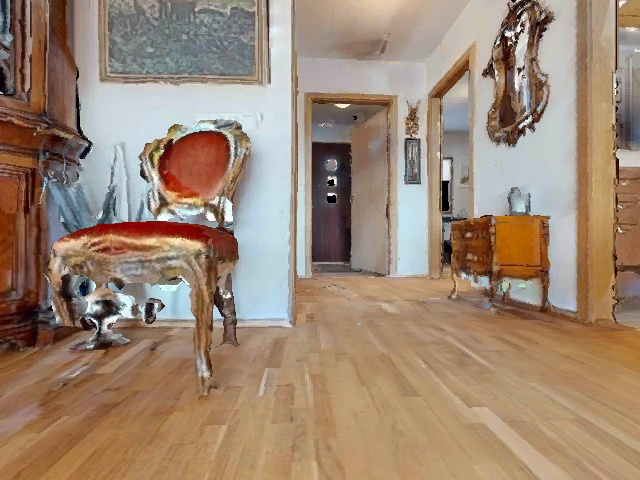
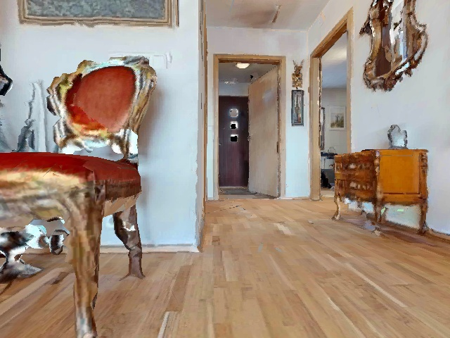
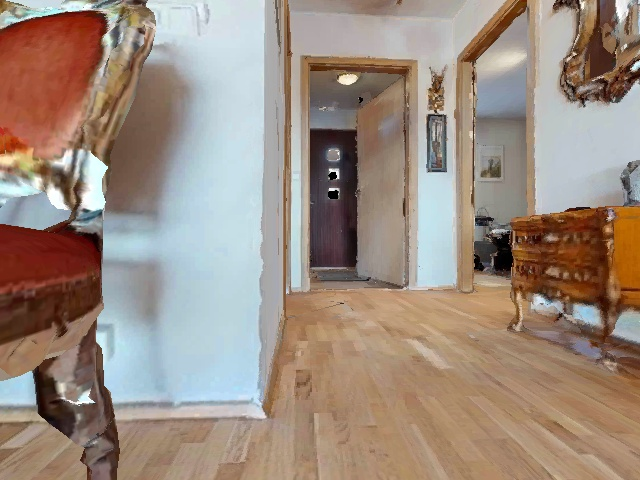
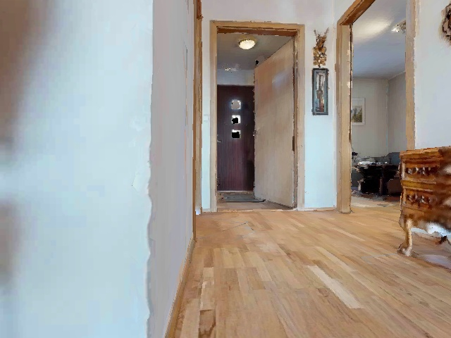

# 세션 문서

**세션 시작 시간**: 2025-12-11 18:37:52

---

## Iteration 1

**시간**: 2025-12-11 18:38:07

**컨텍스트**: ### Instruction :  I'm cold, find heater 

### 이미지

### 캡션

****START OF REASONING CONTEXT****

1. **Scene Description**: The image shows a hallway with wooden flooring, flanked by ornamental furniture. There's a vintage chair on the left, a small cabinet on the right, and an ornate mirror on the wall. The hallway leads to multiple rooms with open doors, indicating possible paths for navigation. The space is wide enough for a quadruped robot to move comfortably.

2. **High-Level Planning**:
   - Move forward along the hallway while maintaining distance from the furniture to avoid collision.
   - Pass the chair on the left and approach the first doorway on the right.
   - Assess inside the room on the right for any visible heater.
   - If no heater is found, return to the hallway and proceed to the next room.
   - Repeat the search process in each subsequent room along the hallway.

3. **Historical Summarization**: Previously, no specific action or direction was followed; the focus is now on finding a heater to address the request of warmth.

4. **Immediate Action Instruction**: Move forward down the hallway, keeping to the center to avoid bumping into the chair or cabinet, and approach the first doorway on the right.

****END OF REASONING CONTEXT****

---

## Iteration 2

**시간**: 2025-12-11 18:39:00

**컨텍스트**: ### Instruction :  I'm cold, find heater 

추가 컨텍스트: ****START OF REASONING CONTEXT****

1. **Scene Description**: The image shows a hallway with wooden flooring, flanked by ornamental furniture. There's a vintage chair on the left, a small cabinet on the right, and an ornate mirror on the wall. The hallway leads to multiple rooms with open doors, indicating possible paths for navigation. The space is wide enough for a quadruped robot to move comfortably.

2. **High-Level Planning**:
   - Move forward along the hallway while maintaining distance from the furniture to avoid collision.
   - Pass the chair on the left and approach the first doorway on the right.
   - Assess inside the room on the right for any visible heater.
   - If no heater is found, return to the hallway and proceed to the next room.
   - Repeat the search process in each subsequent room along the hallway.

3. **Historical Summarization**: Previously, no specific action or direction was followed; the focus is now on finding a heater to address the request of warmth.

4. **Immediate Action Instruction**: Move forward down the hallway, keeping to the center to avoid bumping into the chair or cabinet, and approach the first doorway on the right.

****END OF REASONING CONTEXT****

### 이미지

### 캡션

****START OF REASONING CONTEXT****

1. **Scene Description**: The hallway is well-lit, with a wooden floor that provides a stable surface for movement. The corridor is wide, allowing the quadruped robot to navigate without obstruction. The open doors on the right suggest access to other rooms, which may contain a heater. The mirror on the wall and furniture indicate a residential setting.

2. **High-Level Planning**:
   - Move straight down the center of the hallway to avoid the furniture.
   - Turn right into the first open room and scan for a heater.
   - If a heater is not present, exit the room and return to the hallway.
   - Continue to the next available doorway and repeat the search.
   - Explore each room methodically until a heater is located.

3. **Historical Summarization**: The robot has been tasked with locating a heater due to a request for warmth. Initial movement is planned from the current position towards rooms in the hallway, as no navigation has started yet.

4. **Immediate Action Instruction**: Proceed down the hallway while keeping a central path. Enter the first room on the right and visually scan for a heater.

****END OF REASONING CONTEXT****

---

## Iteration 3

**시간**: 2025-12-11 18:39:50

**컨텍스트**: ### Instruction :  I'm cold, find heater 

추가 컨텍스트: ****START OF REASONING CONTEXT****

1. **Scene Description**: The hallway is well-lit, with a wooden floor that provides a stable surface for movement. The corridor is wide, allowing the quadruped robot to navigate without obstruction. The open doors on the right suggest access to other rooms, which may contain a heater. The mirror on the wall and furniture indicate a residential setting.

2. **High-Level Planning**:
   - Move straight down the center of the hallway to avoid the furniture.
   - Turn right into the first open room and scan for a heater.
   - If a heater is not present, exit the room and return to the hallway.
   - Continue to the next available doorway and repeat the search.
   - Explore each room methodically until a heater is located.

3. **Historical Summarization**: The robot has been tasked with locating a heater due to a request for warmth. Initial movement is planned from the current position towards rooms in the hallway, as no navigation has started yet.

4. **Immediate Action Instruction**: Proceed down the hallway while keeping a central path. Enter the first room on the right and visually scan for a heater.

****END OF REASONING CONTEXT****

### 이미지

### 캡션

****START OF REASONING CONTEXT****

1. **Scene Description**: The image shows a hallway with wooden flooring, providing good traction for the robot. There are two doorways on the right, allowing access to additional rooms. The furniture is positioned along the sides, keeping the center clear for navigation. Lighting is sufficient for visual scanning.

2. **High-Level Planning**:
   - Move straight along the hallway's center to avoid collisions.
   - Enter the first open doorway on the right and inspect for the presence of a heater.
   - Exit if no heater is found and return to the hallway.
   - Continue to the second doorway on the right and repeat the scanning process.
   - If a heater is not located, proceed to check any other accessible rooms.
   - Once found, approach the heater to provide warmth.

3. **Historical Summarization**: So far, the robot has received instructions to locate a heater in response to a cold temperature condition. The initial focus is on examining nearby rooms in sequence, starting with those on the right.

4. **Immediate Action Instruction**: Advance down the hallway, keeping to the center. Enter the first open doorway on the right side and begin a visual scan for a heater.

****END OF REASONING CONTEXT****

---

## Iteration 4

**시간**: 2025-12-11 18:40:35

**컨텍스트**: ### Instruction :  I'm cold, find heater 

추가 컨텍스트: ****START OF REASONING CONTEXT****

1. **Scene Description**: The image shows a hallway with wooden flooring, providing good traction for the robot. There are two doorways on the right, allowing access to additional rooms. The furniture is positioned along the sides, keeping the center clear for navigation. Lighting is sufficient for visual scanning.

2. **High-Level Planning**:
   - Move straight along the hallway's center to avoid collisions.
   - Enter the first open doorway on the right and inspect for the presence of a heater.
   - Exit if no heater is found and return to the hallway.
   - Continue to the second doorway on the right and repeat the scanning process.
   - If a heater is not located, proceed to check any other accessible rooms.
   - Once found, approach the heater to provide warmth.

3. **Historical Summarization**: So far, the robot has received instructions to locate a heater in response to a cold temperature condition. The initial focus is on examining nearby rooms in sequence, starting with those on the right.

4. **Immediate Action Instruction**: Advance down the hallway, keeping to the center. Enter the first open doorway on the right side and begin a visual scan for a heater.

****END OF REASONING CONTEXT****

### 이미지

### 캡션

****START OF REASONING CONTEXT****

1. **Scene Description**: The hallway features a smooth wooden floor conducive to stable movement. Two doorways to the right provide access to rooms for exploration. The hallway's open center ensures unobstructed navigation, with furniture arranged along the walls. Adequate lighting supports effective visual scanning.

2. **High-Level Planning**:
   - Proceed straight down the center of the hallway for optimal navigation.
   - Enter the first doorway on the right to search for the heater.
   - Conduct a thorough visual scan of the room to identify the heater.
   - If unsuccessful, return to the hallway and proceed to the second doorway on the right.
   - Repeat the scanning process in the second room.
   - Extend the search to any remaining accessible areas until the heater is located.
   - Once the heater is found, move closer to confirm its presence and readiness.

3. **Historical Summarization**: The directive is to locate a heater due to a cold environment. The robot has been instructed to systematically search the available rooms to the right, with emphasis on thoroughness and efficiency.

4. **Immediate Action Instruction**: Move straight through the hallway, maintaining central alignment. Enter the first right-hand doorway and begin scanning the room for a heater.

****END OF REASONING CONTEXT****

---

